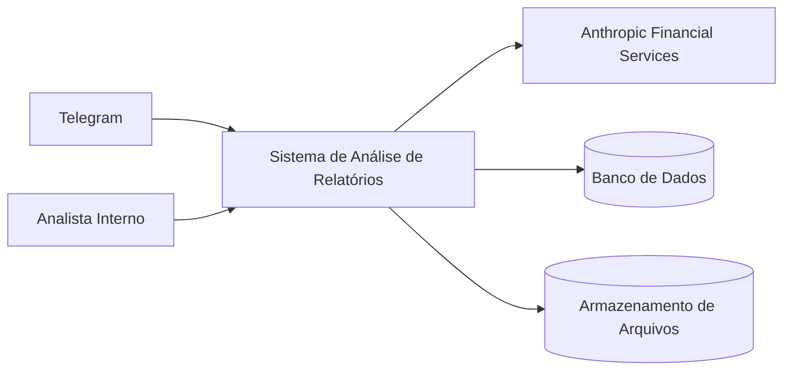
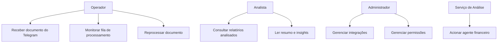
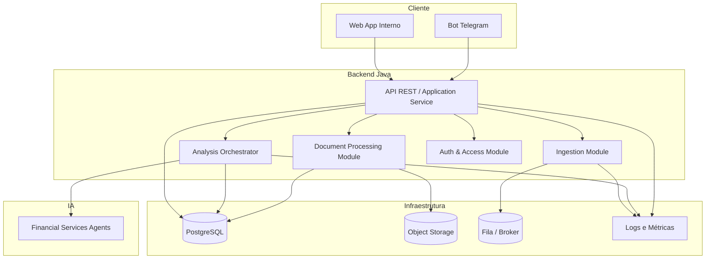
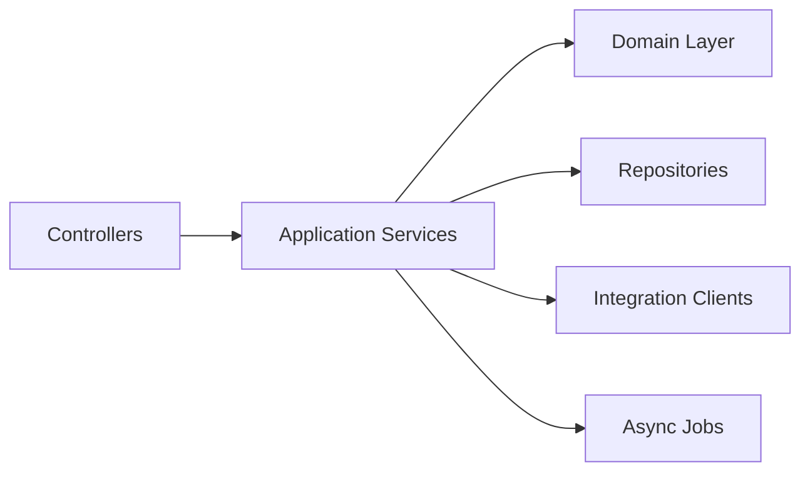
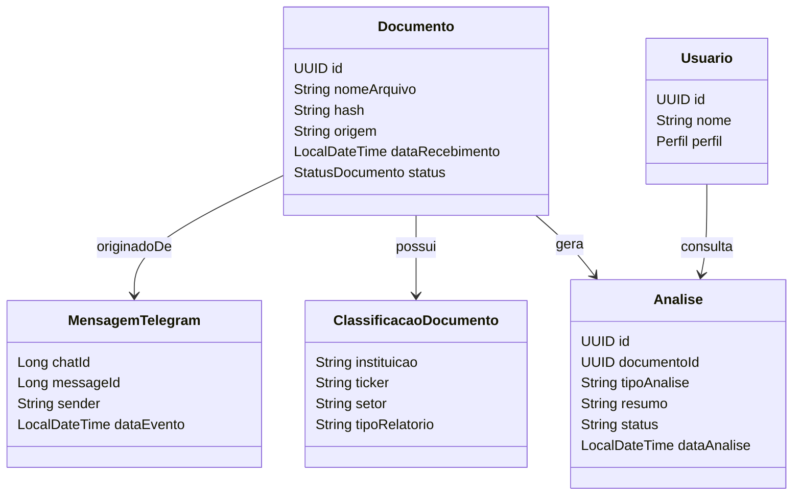
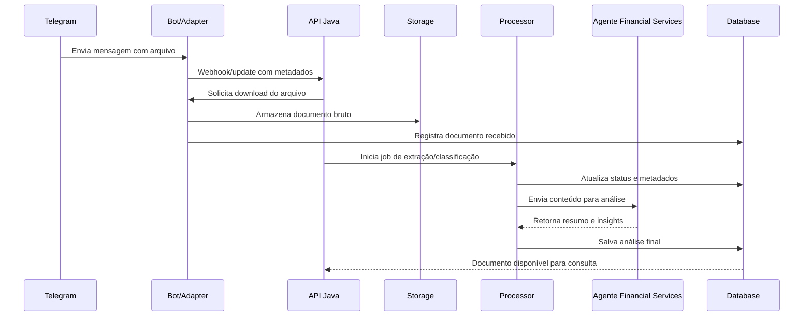
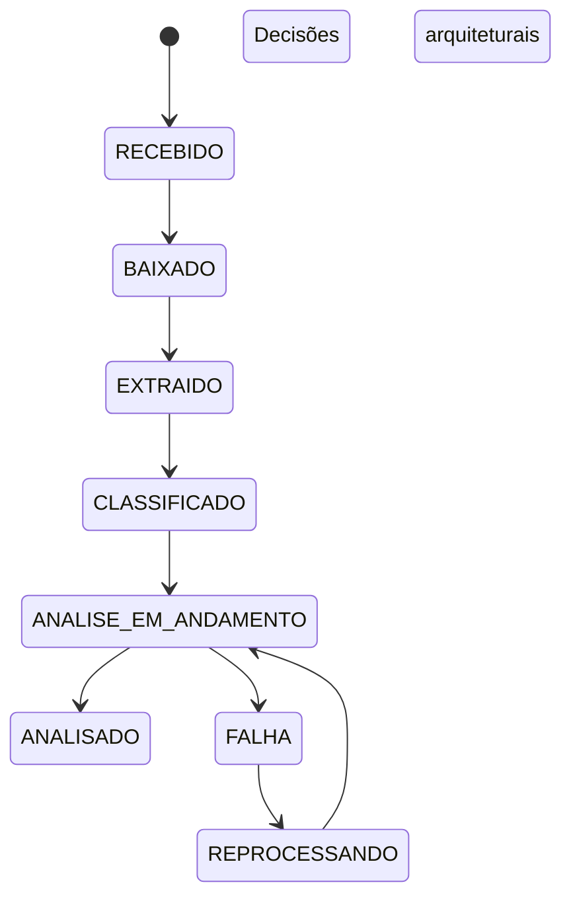

# research-automation

## Descrição do projeto

O sistema deve captar arquivos recebidos via Telegram, registrar metadados, armazenar os documentos, extrair texto, 
encaminhar o conteúdo para agentes especializados de análise financeira e devolver resumos e classificações para 
analistas internos.

A base `anthropics/financial-services` foi publicada como um conjunto de plugins e agentes para fluxos de financial 
analysis, equity research, investment banking, private equity e wealth management, podendo ser usada via Cowork ou por 
deploy com Claude Managed Agents API.


## Funcionalidades principais

- Receber relatórios financeiros enviados em chats ou canais monitorados no Telegram.
- Baixar arquivos anexados, como PDF, DOCX e planilhas, para processamento interno.
- Catalogar documentos por banco emissor, data, ativo, setor, tipo de relatório e status de processamento.
- Extrair texto do arquivo e preparar insumos para análise automatizada.
- Acionar agentes especializados como *Market Researcher* e *Earnings Reviewer* para resumir e interpretar os relatórios.
- Salvar análises, tags, riscos, catalysts e recomendações em uma base consultável.
- Disponibilizar busca interna por ativo, instituição, período e tema do relatório.
- Publicar um resumo final para consumo operacional, por exemplo em painel interno ou retorno no próprio Telegram.


## Tecnologias usadas

- Linguagem: Java 21
- Build: Maven
- Dependências: Spring Web, Spring Data JPA, Validation, Lombok, PostgreSQL Driver, H2 (scope test), Spring Boot Actuator


## Estrutura de pacotes do projeto 

```
src/
└── main/
    └── java/
        └── br/com/diegoaugustofp/research_automation
            ├── application/                  ← casos de uso / serviços de aplicação
            │   ├── document/
            │   │   ├── DocumentIngestionService.java
            │   │   ├── DocumentQueryService.java
            │   │   └── dto/
            │   │       ├── DocumentRequestDTO.java
            │   │       └── DocumentResponseDTO.java
            │   ├── analysis/
            │   │   ├── AnalysisOrchestrationService.java
            │   │   └── dto/
            │   │       └── AnalysisResultDTO.java
            │   └── security/
            │       └── UserAccessService.java
            │
            ├── domain/                       ← entidades, enums, regras de domínio
            │   ├── document/
            │   │   ├── Document.java
            │   │   ├── DocumentStatus.java
            │   │   ├── DocumentClassification.java
            │   │   ├── TelegramMessage.java
            │   │   └── DocumentRepository.java
            │   ├── analysis/
            │   │   ├── Analysis.java
            │   │   ├── AnalysisStatus.java
            │   │   └── AnalysisRepository.java
            │   └── user/
            │       ├── User.java
            │       └── UserRole.java
            │
            ├── infrastructure/               ← implementações técnicas externas
            │   ├── persistence/
            │   │   ├── JpaDocumentRepository.java
            │   │   └── JpaAnalysisRepository.java
            │   ├── telegram/
            │   │   ├── TelegramAdapter.java
            │   │   └── TelegramFileDownloader.java
            │   ├── ai/
            │   │   ├── FinancialAnalysisClient.java   ← interface
            │   │   └── AnthropicAnalysisClient.java   ← implementação
            │   ├── storage/
            │   │   └── LocalFileStorageService.java
            │   └── config/
            │       ├── AppConfig.java
            │       └── SecurityConfig.java
            │
            └── interfaces/                   ← entradas da aplicação
                ├── api/
                │   ├── DocumentController.java
                │   ├── AnalysisController.java
                │   └── HealthController.java
                └── scheduler/
                    └── RetryFailedAnalysisJob.java

src/
└── test/
    └── java/
        └── com/empresa/researchautomation/
            ├── application/
            │   ├── document/
            │   │   └── DocumentIngestionServiceTest.java
            │   └── analysis/
            │       └── AnalysisOrchestrationServiceTest.java
            ├── domain/
            │   └── document/
            │       └── DocumentStatusTest.java
            └── interfaces/
                └── api/
                    └── DocumentControllerTest.java
```

## Desenho da solução
A arquitetura em camadas com serviços desacoplados por responsabilidade: ingestão de eventos do Telegram, processamento 
documental, orquestração de análise, persistência e API de consulta.

### Visão de contexto



### Casos de uso principais




### Containers da solução




### Componentes internos do backend



### Entidades principais do domínio



### Sequência de processamento


### Estados do documento


